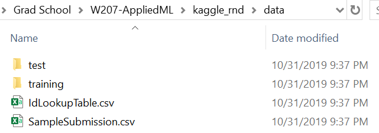

The code in this repo will expect that all the data used lives in a folder called `data` at the highest level. If you don't currently have all the data from the Kaggle Facial Keypoints Detection Problem, do the following:
   1) Use the existing `data` folder
   2) Download the Facial Keypoints Detection data from https://www.kaggle.com/c/3486/download-all
   3) Unzip the folder and place the extracted contents in `data`
   4) Unzip `train.zip` as `train`
   5) Unzip `test.zip` as `test`
Your end result should look like this:
